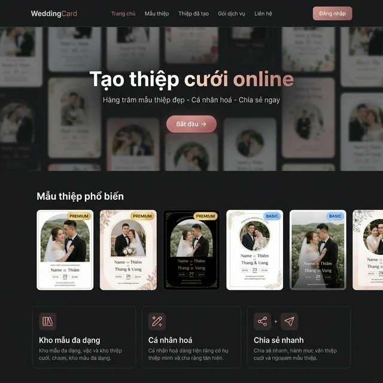
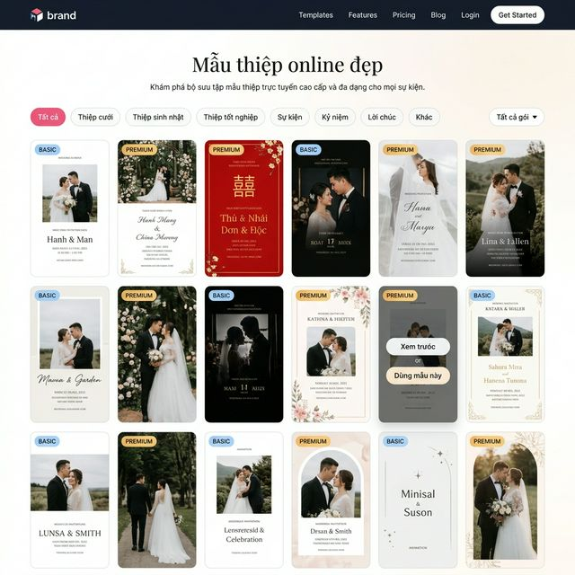
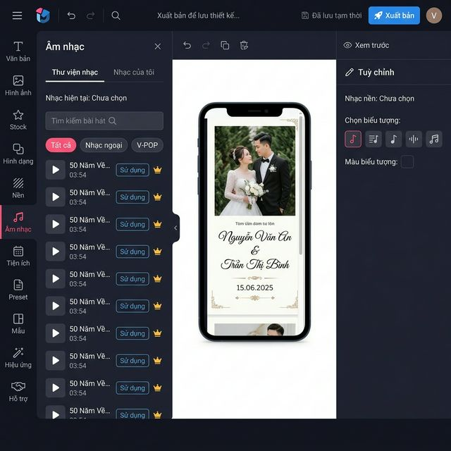
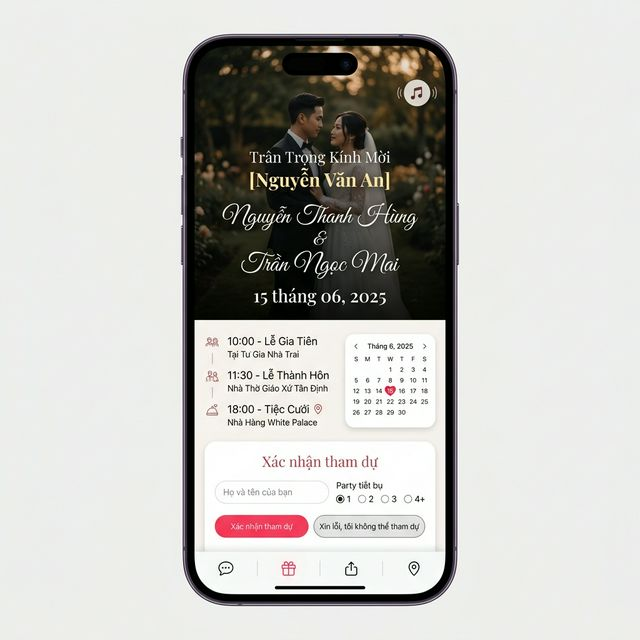
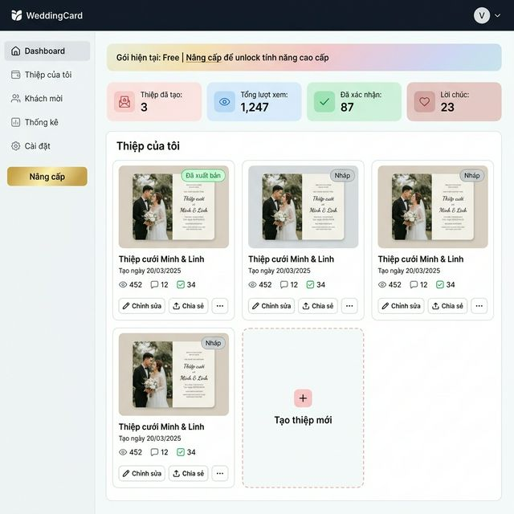
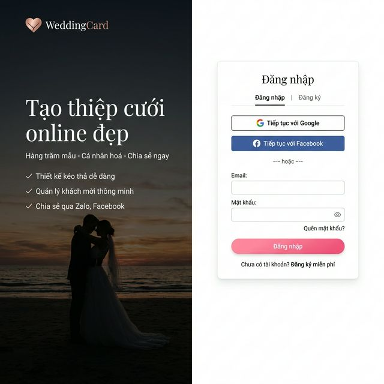
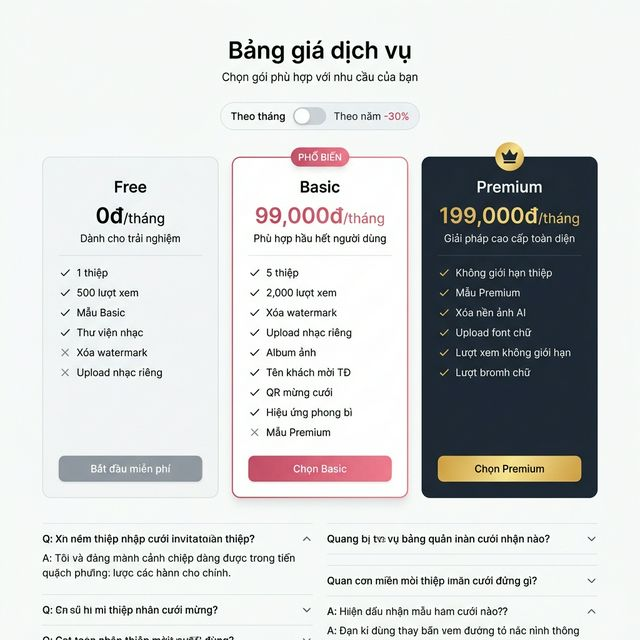
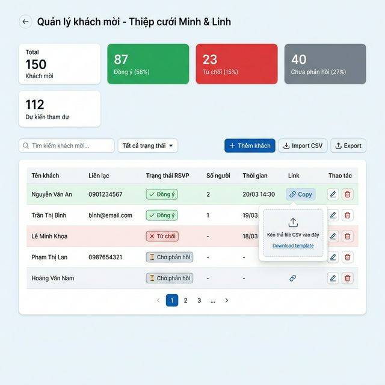

# 📋 MASTER SPEC — Hệ thống Thiệp Cưới Online

> **Version:** 1.0 | **Created:** 2026-03-29  
> Tài liệu tổng hợp toàn bộ nghiệp vụ, thiết kế UI, tech stack cho hệ thống thiệp cưới online.
> Tham khảo: phân tích từ cinelove.me (thực tế, confirmed từ editor screenshots)

---

## 1. TỔNG QUAN HỆ THỐNG

### 1.1 Mô tả
Nền tảng tạo thiệp cưới online dạng SaaS, cho phép người dùng:
- Chọn mẫu thiệp đẹp từ thư viện
- Chỉnh sửa nội dung bằng drag-and-drop editor
- Chia sẻ link thiệp đến khách mời (có thể cá nhân hoá tên)
- Quản lý danh sách khách và theo dõi RSVP
- Xem analytics lượt xem

### 1.2 URL Map
```
/                             # Trang chủ
/templates                    # Thư viện mẫu thiệp
/pricing-plans                # Bảng giá
/login | /register            # Auth
/forgot-password              # Reset mật khẩu
/reset-password               # Đặt lại mật khẩu (từ email)
/dashboard                    # 🔐 Danh sách thiệp của tôi
/editor-template/:id          # 🔐 Trình chỉnh sửa
/dashboard/guests/:id         # 🔐 Quản lý khách mời
/dashboard/analytics/:id      # 🔐 Thống kê
/dashboard/settings           # 🔐 Cài đặt tài khoản & Gói
/checkout/upgrade             # 🔐 Nâng cấp gói
/{slug}                       # 🌐 Xem thiệp (public)
/{slug}?name=NguyenVanA       # 🌐 Xem thiệp cá nhân hoá
```

---

## 2. AUTH & USER MANAGEMENT

### 2.1 Đăng ký
- Input: Email + Password (≥8 ký tự) + Tên hiển thị
- Validate email unique, hash password bcrypt
- Tạo user với `plan = free`
- Option: Google OAuth / Facebook OAuth

### 2.2 Đăng nhập
- Email + Password → JWT (access: 1h, refresh: 30d)
- Google OAuth → auto tạo user nếu email chưa tồn tại
- `callbackUrl` param để redirect sau login

### 2.3 Quên mật khẩu & Cài đặt tài khoản
- **Quên mật khẩu:** Nhập email → gửi OTP/Link reset (ẩn danh) → Form đặt lại mật khẩu mới.
- **Cài đặt tài khoản (`/dashboard/settings`):**
  - Cập nhật thông tin cá nhân (Tên, Số điện thoại, Avatar).
  - Đổi mật khẩu.
  - Quản lý gói hiện tại (Hiển thị % dung lượng, thời gian hết hạn).

### 2.4 User Schema
```
users {
  id UUID PK,
  email VARCHAR UNIQUE,
  name VARCHAR(50),
  avatar_url TEXT,
  password_hash TEXT,
  plan ENUM('free','basic','premium') DEFAULT 'free',
  plan_expires_at TIMESTAMP,
  google_id TEXT,
  created_at, updated_at
}
```

### 2.4 Plan Limits
| Limit | Free | Basic | Premium |
|-------|------|-------|---------|
| Số thiệp | 1 | 5 | Unlimited |
| Lượt xem/thiệp | 500 | 2,000 | Unlimited |
| Ảnh upload | 10 | 50 | 200 |
| Storage | 500MB | 2GB | 10GB |

---

## 3. TEMPLATE SYSTEM

### 3.1 Template Schema
```
templates {
  id UUID PK,
  name VARCHAR,
  thumbnail_url TEXT,
  tier ENUM('free','basic','premium'),
  category ENUM('wedding','birthday','graduation','event','anniversary','wish','other'),
  config_json JSONB,
  preview_url TEXT,
  usage_count INT DEFAULT 0,
  is_active BOOLEAN DEFAULT true,
  is_featured BOOLEAN DEFAULT false,
  created_at
}
```

### 3.2 Config JSON Schema
```json
{
  "version": "1.0",
  "canvas": { "width": 390, "backgroundColor": "#ffffff" },
  "music": { "url": null, "icon": "vinyl", "iconColor": "#000000" },
  "effects": { "animation": "none" },
  "sections": [
    {
      "id": "section-1",
      "type": "hero",
      "height": 844,
      "background": { "type": "color", "value": "#f5f0eb" },
      "elements": [
        {
          "id": "el-1", "type": "text",
          "x": 50, "y": 200, "width": 290, "height": 60,
          "content": "{{groom}} & {{bride}}",
          "style": { "fontSize": 32, "fontFamily": "Dancing Script",
                      "color": "#333333", "textAlign": "center", "opacity": 1 }
        }
      ]
    }
  ]
}
```

### 3.3 Template Variables
| Variable | Mô tả |
|----------|-------|
| `{{groom}}` | Tên chú rể |
| `{{bride}}` | Tên cô dâu |
| `{{wedding_date}}` | Ngày cưới |
| `{{ceremony_time}}` | Giờ làm lễ |
| `{{venue_name}}` | Tên địa điểm |
| `{{venue_address}}` | Địa chỉ đầy đủ |
| `{{photo_1..15}}` | Ảnh 1 đến 15 |
| `{{guest_name}}` | Tên khách mời (URL param) |

### 3.4 Gating Rules
- `tier=free`: mọi user dùng được
- `tier=basic`: cần plan `basic` hoặc `premium`
- `tier=premium`: chỉ `premium`
- Click template tier cao hơn → modal "Nâng cấp gói"

---

## 4. EDITOR

### 4.1 Layout (3 panels)
```
[Left Icon Sidebar 60px] [Expanded Panel 250px] [Canvas] [Right Panel 260px]
```

**Top bar:** ☰ | Logo | ↩ Undo | ↪ Redo | ·· | Status "Đã lưu tạm thời" | Xem trước | Xuất bản

### 4.2 Left Sidebar — 10 Tabs
| # | Tab | Panel Content |
|---|-----|--------------|
| 1 | Văn bản | Thêm text block, preset text pairs |
| 2 | Hình ảnh | Upload gallery (max 15 files, 5GB), click → add to canvas |
| 3 | Stock | Thư viện sticker: đám cưới, hoa, nhân vật, chữ Hỷ |
| 4 | Hình dạng | Line, rectangle, circle, triangle |
| 5 | Nền | Tab Màu nền (color picker) + Tab Hình nền (texture library) |
| 6 | Âm nhạc | Thư viện nhạc (Tất cả/Nhạc ngoại/V-POP) + Tab Nhạc của tôi |
| 7 | Tiện ích | Free: Calendar, Countdown, Map, Call, RSVP. Premium: Form, Guest Name, QR Box, Envelope, Album, Video, Particles |
| 8 | Preset | Pre-built blocks: Hero, Timeline, Dress code, Album, QR Bank |
| 9 | Mẫu | Đổi template (confirm overwrite) |
| 10 | Hiệu ứng | None / Fade In All / Slide Up All / Scale In All / Flip In All / Slide Up Mix / Fade In Mix |

### 4.3 Canvas Engine
- Mobile-first: width = 390px
- Drag & drop elements, resize handles, delete, undo/redo (50 steps)
- Zoom: 50%/75%/100%/125%
- Double-click text → inline edit
- Click outside → deselect

### 4.4 Right Panel — Text Properties
| Property | UI |
|----------|---|
| Kiểu chữ | B I S U Aa ≡ |
| Căn chỉnh | ← ↔ → ≡ |
| Font size | −/+ number |
| Font | Dropdown Google Fonts |
| Màu chữ + nền | Color picker |
| Trong suốt | Slider 0–1 |
| Khoảng đệm | TRBL inputs |
| Đường viền | Width + color + style |
| Đổ bóng | x/y/blur/color |
| Liên kết | URL input |

### 4.5 Right Panel — Image Properties
- Crop, Filter (None/Grayscale/Sepia/Warm/Cool)
- Opacity, Border radius, Rotate, Flip
- Xóa nền AI (Premium)

### 4.6 Right Panel — Global (no selection)
- Danh mục* (dropdown)
- Trạng thái (Công khai / Riêng tư)
- Bản xem trước OG: ảnh + tiêu đề + mô tả

### 4.7 Publish Flow
1. Click "Xuất bản" → set `status=published`
2. Modal: Share URL + QR code + Copy / Facebook / Zalo
3. User có thể unpublish bất cứ lúc nào

### 4.8 Auto-save
- Debounce 2s sau mỗi thay đổi → `PUT /api/invitations/:id`
- Indicator: "Đang lưu..." → "Đã lưu tạm thời"

---

## 5. DATABASE SCHEMA (Full)

```sql
-- Users
CREATE TABLE users (
  id UUID PRIMARY KEY DEFAULT gen_random_uuid(),
  email VARCHAR(255) UNIQUE NOT NULL,
  name VARCHAR(100),
  avatar_url TEXT,
  password_hash TEXT,
  plan VARCHAR(20) DEFAULT 'free' CHECK (plan IN ('free','basic','premium')),
  plan_expires_at TIMESTAMPTZ,
  google_id TEXT UNIQUE,
  created_at TIMESTAMPTZ DEFAULT NOW(),
  updated_at TIMESTAMPTZ DEFAULT NOW()
);

-- Templates
CREATE TABLE templates (
  id UUID PRIMARY KEY DEFAULT gen_random_uuid(),
  name VARCHAR(200),
  thumbnail_url TEXT,
  tier VARCHAR(20) DEFAULT 'free' CHECK (tier IN ('free','basic','premium')),
  category VARCHAR(50),
  config_json JSONB,
  preview_url TEXT,
  usage_count INT DEFAULT 0,
  is_active BOOLEAN DEFAULT true,
  is_featured BOOLEAN DEFAULT false,
  created_at TIMESTAMPTZ DEFAULT NOW()
);

-- Invitations
CREATE TABLE invitations (
  id UUID PRIMARY KEY DEFAULT gen_random_uuid(),
  user_id UUID REFERENCES users(id) ON DELETE CASCADE,
  template_id UUID REFERENCES templates(id),
  slug VARCHAR(100) UNIQUE NOT NULL,
  title VARCHAR(200),
  config_json JSONB,
  status VARCHAR(20) DEFAULT 'draft' CHECK (status IN ('draft','published')),
  published_at TIMESTAMPTZ,
  view_count INT DEFAULT 0,
  og_title TEXT,
  og_description TEXT,
  og_image TEXT,
  created_at TIMESTAMPTZ DEFAULT NOW(),
  updated_at TIMESTAMPTZ DEFAULT NOW()
);

-- Guests
CREATE TABLE guests (
  id UUID PRIMARY KEY DEFAULT gen_random_uuid(),
  invitation_id UUID REFERENCES invitations(id) ON DELETE CASCADE,
  name VARCHAR(100) NOT NULL,
  phone VARCHAR(20),
  email VARCHAR(255),
  rsvp_status VARCHAR(20) DEFAULT 'pending' CHECK (rsvp_status IN ('pending','attending','declined')),
  party_size INT DEFAULT 1,
  note TEXT,
  responded_at TIMESTAMPTZ,
  created_at TIMESTAMPTZ DEFAULT NOW()
);

-- Messages (lời chúc)
CREATE TABLE messages (
  id UUID PRIMARY KEY DEFAULT gen_random_uuid(),
  invitation_id UUID REFERENCES invitations(id) ON DELETE CASCADE,
  guest_name VARCHAR(100),
  content TEXT NOT NULL,
  is_approved BOOLEAN DEFAULT true,
  created_at TIMESTAMPTZ DEFAULT NOW()
);

-- Analytics events
CREATE TABLE analytics_events (
  id UUID PRIMARY KEY DEFAULT gen_random_uuid(),
  invitation_id UUID REFERENCES invitations(id) ON DELETE CASCADE,
  event_type VARCHAR(50) CHECK (event_type IN ('view','rsvp_attend','rsvp_decline','wish_sent','qr_view','share')),
  ip_hash VARCHAR(64),
  user_agent TEXT,
  metadata JSONB,
  created_at TIMESTAMPTZ DEFAULT NOW()
);

-- Media
CREATE TABLE media (
  id UUID PRIMARY KEY DEFAULT gen_random_uuid(),
  user_id UUID REFERENCES users(id) ON DELETE CASCADE,
  url TEXT NOT NULL,
  public_id TEXT NOT NULL,
  type VARCHAR(20) CHECK (type IN ('image','audio')),
  filename VARCHAR(255),
  size_bytes BIGINT,
  created_at TIMESTAMPTZ DEFAULT NOW()
);

-- Payments
CREATE TABLE payments (
  id UUID PRIMARY KEY DEFAULT gen_random_uuid(),
  user_id UUID REFERENCES users(id),
  plan VARCHAR(20),
  duration_months INT,
  amount BIGINT,
  status VARCHAR(20) DEFAULT 'pending' CHECK (status IN ('pending','success','failed')),
  provider VARCHAR(20),
  provider_transaction_id TEXT,
  created_at TIMESTAMPTZ DEFAULT NOW()
);
```

---

## 6. API ENDPOINTS

### Public (no auth)
```
GET  /api/templates               # Danh sách templates
GET  /api/templates/:id           # Chi tiết template
GET  /api/public/:slug            # Guest view data
POST /api/public/:slug/track      # Track view event
POST /api/public/:slug/rsvp       # Submit RSVP
GET  /api/public/:slug/messages   # Lấy lời chúc
POST /api/public/:slug/messages   # Gửi lời chúc
```

### Auth required 🔐
```
POST /api/auth/register
POST /api/auth/login
POST /api/auth/logout
POST /api/auth/refresh
GET  /api/auth/me

GET  /api/invitations             # Danh sách thiệp của user
POST /api/invitations             # Tạo thiệp từ template
GET  /api/invitations/:id         # Chi tiết + config_json
PUT  /api/invitations/:id         # Save editor state
POST /api/invitations/:id/publish # Xuất bản
DELETE /api/invitations/:id       # Xóa thiệp

GET  /api/invitations/:id/guests         # Danh sách khách
POST /api/invitations/:id/guests         # Thêm khách
POST /api/invitations/:id/guests/import  # Import CSV
GET  /api/invitations/:id/analytics      # Thống kê

POST /api/media/upload            # Upload ảnh/nhạc → Cloudinary
DELETE /api/media/:id             # Xóa media
POST /api/media/remove-bg         # AI remove background (Premium)

POST /api/payments/checkout       # Tạo VNPay URL
POST /api/payments/webhook        # VNPay callback
GET  /api/payments/history        # Lịch sử thanh toán
```

---

## 7. GUEST VIEW

### 7.1 Logic render
1. SSR: `GET /api/public/:slug` → trả `config_json`
2. Parse `?name=` → inject tên khách vào widget
3. Track view (dedup IP + cookie 1h)

### 7.2 Sections (từ config_json)
- Hero: ảnh + tên cặp đôi + ngày cưới
- Timeline: lịch trình vật lý
- Calendar: tháng cưới + ngày đánh dấu ❤️
- Info: giờ/địa điểm + Google Maps
- RSVP Form: xác nhận tham dự
- Lời chúc: feed + form gửi mới
- QR Bank: thông tin chuyển khoản
- Bottom bar (floating): 💬 Lời chúc | 💝 Hộp mừng | 📤 Chia sẻ | 📍 Bản đồ

### 7.3 Cá nhân hoá
- URL: `/{slug}?name=Nguyễn+Văn+An`
- Widget "Tên KM" hiển thị: "Kính mời **Nguyễn Văn An**"

### 7.4 Hiệu ứng mở màn (Premium)
- Animation phong bì: tap → mở flap → reveal thiệp
- Particles: hoa anh đào / tim rơi

---

## 8. GUEST MANAGEMENT

### 8.1 RSVP Matching
- Guest submit `{name, rsvp_status, party_size}` → match `ilike(name)` trong DB
- Không match → tạo guest mới (walk-in)

### 8.2 Unique Link
`/{slug}?name={encodeURIComponent(guest.name)}`

### 8.3 Import CSV
- Format: Tên | Phone | Email
- Preview → confirm → import (skip duplicates by name)

---

## 9. ANALYTICS

| Event | Tracked |
|-------|---------|
| view | Mở thiệp (dedup 1h) |
| rsvp_attend | Xác nhận tham dự |
| rsvp_decline | Từ chối |
| wish_sent | Gửi lời chúc |
| qr_view | Xem QR mừng |

---

## 10. PRICING

### Gói & Giá
| | Free | Basic | Premium |
|-|------|-------|---------|
| Giá/tháng | 0đ | 99,000đ | 199,000đ |
| Thiệp | 1 | 5 | ∞ |
| Templates | Basic | Basic | Basic + Premium |
| Watermark | Có | Không | Không |
| Upload nhạc | Không | Có | Có |
| Album ảnh | Không | Có | Có |
| QR Bank | Không | Có | Có |
| Tên KM TĐ | Không | Có | Có |
| Video YouTube | Không | Có | Có |
| Phong bì | Không | Có | Có |
| AI Remove BG | Không | Không | Có |
| Custom Font | Không | Không | Có |

### Payment Flow (VNPay)
1. POST `/api/payments/checkout` → tạo URL
2. Redirect VNPay → user thanh toán
3. Webhook → verify → update `user.plan + plan_expires_at`

---

## 11. TECH STACK

### Frontend
```
Next.js 14 (App Router)
React 18
Tailwind CSS 3
Framer Motion (hiệu ứng mở màn, scroll animations)
Zustand (editor state)
React Hook Form + Zod (validation)
SWR (data fetching + revalidation)
```

### Backend
```
Node.js + Express.js
Prisma ORM
PostgreSQL
Redis (cache, session)
Cloudinary (media storage + AI remove bg)
NextAuth.js
Multer (file upload)
Sharp (image resize)
node-cron (plan expiry check)
```

### Infrastructure
```
Deployment: Vercel (frontend) + Railway/Render (backend)
DB: Supabase PostgreSQL
Media: Cloudinary
Payments: VNPay
```

---

## 12. MOCKUP REFERENCES

### 12.1 Trang chủ (Homepage)
> URL: `/` | Layout: Desktop 1440px | Dark cinematic theme



---

### 12.2 Thư viện mẫu thiệp (Templates)
> URL: `/templates` | Filter tabs + grid 6 cột + badge BASIC/PREMIUM



---

### 12.3 Editor (Trình chỉnh sửa)
> URL: `/editor-template/:id` | 3 panels: Left sidebar 10 tabs + Canvas + Right properties



**Chú thích Editor:**
- **Left sidebar (60px):** 10 icon tabs — Văn bản, Hình ảnh, Stock, Hình dạng, Nền, Âm nhạc, Tiện ích, Preset, Mẫu, Hiệu ứng
- **Expanded panel (250px):** Nội dung của tab đang active (vd: Music library với Search + tabs + song list)
- **Canvas (center):** Mobile preview 390px với thiệp cưới thực tế
- **Right panel (260px):** Global settings hoặc element properties khi click element

---

### 12.4 Guest View — Xem thiệp (Mobile)
> URL: `/{slug}?name=NguyenVanA` | Full mobile scroll, không cần auth



---

### 12.5 Dashboard (Trang quản lý)
> URL: `/dashboard` | 🔐 Auth required | Left sidebar nav



---

### 12.6 Đăng nhập / Đăng ký
> URL: `/login` | `/register` | Split screen design



---

### 12.7 Bảng giá (Pricing)
> URL: `/pricing-plans` | 3 gói: Free / Basic / Premium



---

### 12.8 Quản lý khách mời
> URL: `/dashboard/guests/:id` | 🔐 Auth required



---

### 12.9 CÁC MÀN HÌNH CHƯA CÓ MOCKUP (CẦN BỔ SUNG)
Các màn hình sau đã có trong nghiệp vụ nhưng chưa có mockup chính thức. Sẽ cần tạo mockup trong Phase tiếp theo:
1. **Quên mật khẩu / Reset Password:** (`/forgot-password`) — Form nhập email và form nhập pass mới.
2. **Thống kê (Analytics):** (`/dashboard/analytics/:id`) — Biểu đồ lượt xem khu vực, thống kê chi tiết.
3. **Thanh toán & Cổng Checkout:** (`/checkout/upgrade`) — Giao diện tóm tắt gói cước trước khi redirect sang VNPay.
4. **Cài đặt Tài khoản:** (`/dashboard/settings`) — Quản lý thông tin cá nhân, Avatar, và đổi mật khẩu.

---

## 13. KEY BUSINESS RULES

1. **Plan gating** áp dụng ở cả client (UI lock) và server (API 403)
2. **Auto-save ≠ Publish** — user phải chủ động click "Xuất bản"
3. **Guest view** là public URL, không cần auth
4. **?name= param** không authenticated — ai có link đều xem được
5. **View limit**: vượt 500/2000 views → watermark overlay
6. **Invitation limit**: vượt quota → disable "Tạo thiệp mới"
7. **Media** thuộc về user, có thể dùng chung nhiều thiệp
8. **Slug** unique globally, auto-generate (MVP), không custom
9. **RSVP match** by name case-insensitive → tạo mới nếu không match
10. **Payment webhook** phải verify signature trước khi update plan
